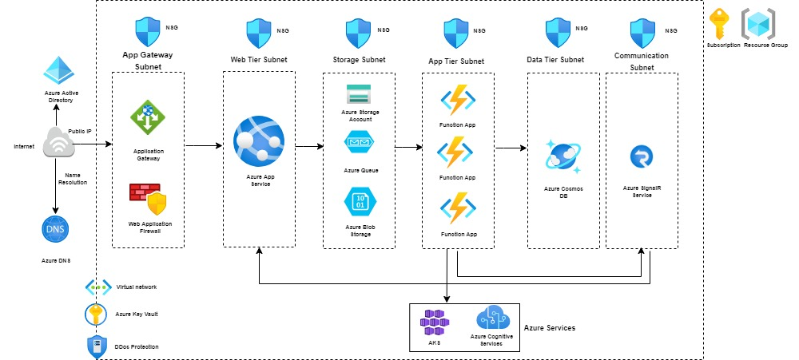

# 3-Tier Environment Architecture




# Terraform code to deploy three-tier architecture on azure
#### Note: Additional improvements and remaining resources are required to produce a production-ready solution.

## Installation
- [Terraform](https://www.terraform.io/downloads.html)

### The Terraform resources will consists of following structure


```
├── main.tf                   // The primary entrypoint for terraform resources.
├── variables.tf              // It contain the declarations for variables.
├── output.tf                 // It contain the declarations for outputs.
├── terraform.tfvars          // The file to pass the terraform variables values.
```
### Module

A module is a collection of resources that are used in combination. In order to describe your infrastructure in terms of its architecture rather than specifically in terms of physical objects, you can use modules to build simple abstractions.

For the solution, we have created and used seven modules:
1. resourcegroup        - creating resourcegroup
2. networking           - creating azure virtual network and required subnets
3. storage-account      - creating Azure Storage Account, Container and Queues for Triggers and bindings in Azure Functions
4. appservice-plan      - creating App Service plan to host web app and function app
5. web-app              - creating web app to host front-end app
6. backend-functionapps - creating function app to host backend-end app
7. cosmos-db            - creating cosmos db account, cosmos sql db and container

The modules folder contains all the stacks, and **terraform.tfvars** contains the variables.

You must add the variables to the terraform.tfvars in order to run the code.

## Deployment

### Steps

**Step 0** `terraform init`

used to initialize a working directory containing Terraform configuration files

**Step 1** `terraform plan`

used to create an execution plan

**Step 2** `terraform validate`

validates the configuration files in a directory

**Step 3** `terraform apply`

used to apply the changes required to reach the desired state of the configuration
